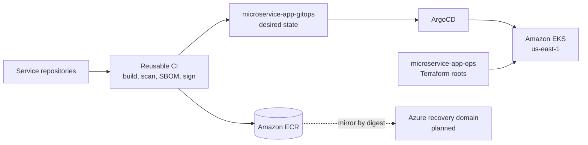

# MicroTodoSuite

MicroTodoSuite is a todo application built from five microservices. GaCode
Solutions designs, builds, and operates it for its client, Lexfield Legal, as a
reference for cloud-native delivery: infrastructure as code, GitOps, a signed
software supply chain, and observable, recoverable operations.

## Platform

- **AWS is the primary platform.** The services run on Amazon EKS in
  `us-east-1`, in an economical profile (one cluster, environments as
  namespaces) and a full profile (a dedicated cluster and VPC per environment).
- **Azure is an independent recovery domain.** A warm-standby AKS cluster, an
  image mirror, and off-provider backups are planned so that the loss of the AWS
  region or account is recoverable. Traffic reaches Azure only through
  health-checked failover.
- **Terraform owns the cloud foundations; ArgoCD owns everything in a cluster.**
  No workload is applied by hand, and every rollback is a `git revert`.
- **Every image is built once**, scanned, described by an SBOM, signed, and
  promoted between environments by digest.

The [architecture document](https://github.com/MicroTodoSuite/microservice-app-docs/blob/main/docs/Architecture%20diagrams.md)
describes the environments, the recovery domain, and the delivery path in detail.

## Services

| Service | Language | Responsibility |
| --- | --- | --- |
| [`frontend`](https://github.com/MicroTodoSuite/microservice-app-frontend) | Vue.js | User interface |
| [`auth-api`](https://github.com/MicroTodoSuite/microservice-app-auth-api) | Go | Authentication and JWT issuance |
| [`users-api`](https://github.com/MicroTodoSuite/microservice-app-users-api) | Java, Spring Boot | User accounts |
| [`todos-api`](https://github.com/MicroTodoSuite/microservice-app-todos-api) | Node.js | Todo operations |
| [`log-message-processor`](https://github.com/MicroTodoSuite/microservice-app-log-message-processor) | Python | Processing of log events published to Redis |

## Platform repositories

| Repository | Responsibility |
| --- | --- |
| [`microservice-app-ops`](https://github.com/MicroTodoSuite/microservice-app-ops) | Live Terraform roots for every AWS environment and the environment lifecycle |
| [`microservice-app-gitops`](https://github.com/MicroTodoSuite/microservice-app-gitops) | Desired state of every cluster, reconciled by ArgoCD |
| [`terraform-aws-modules`](https://github.com/MicroTodoSuite/terraform-aws-modules) | Reusable AWS modules, each versioned independently |
| [`terraform-azure-modules`](https://github.com/MicroTodoSuite/terraform-azure-modules) | Reusable Azure modules for the recovery domain |
| [`.github`](https://github.com/MicroTodoSuite/.github) | Reusable CI and promotion workflows, and this profile |
| [`microservice-app-docs`](https://github.com/MicroTodoSuite/microservice-app-docs) | Constitution, architecture decisions, delivery conventions, and rollout plans |

`microservice-app-example` and `microservice-app-prometheus` are archived and
kept for reference.

## Way of working

- **Specification-driven.** Features are specified, planned, and broken into
  tasks with Spec Kit before implementation, and tests are committed failing
  before the code that satisfies them.
- **Trunk-based.** Every change reaches `main` through a short-lived branch and a
  pull request that follows the
  [delivery conventions](https://github.com/MicroTodoSuite/microservice-app-docs/blob/main/docs/Pull%20request%20and%20task%20tracking%20conventions.md).
- **Kanban.** The team of three works in Infrastructure, CI/CD, and
  Observability lanes on a single board,
  [MicroTodoSuite Delivery 2026](https://github.com/orgs/MicroTodoSuite/projects/7).
- **Governed.** The [constitution](https://github.com/MicroTodoSuite/microservice-app-docs/blob/main/constitution.md)
  sets the non-negotiable principles; everything in the organization is written
  in English.
